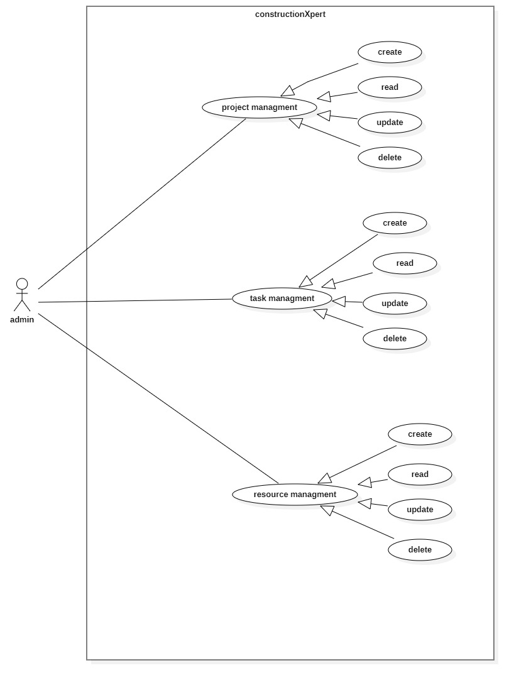
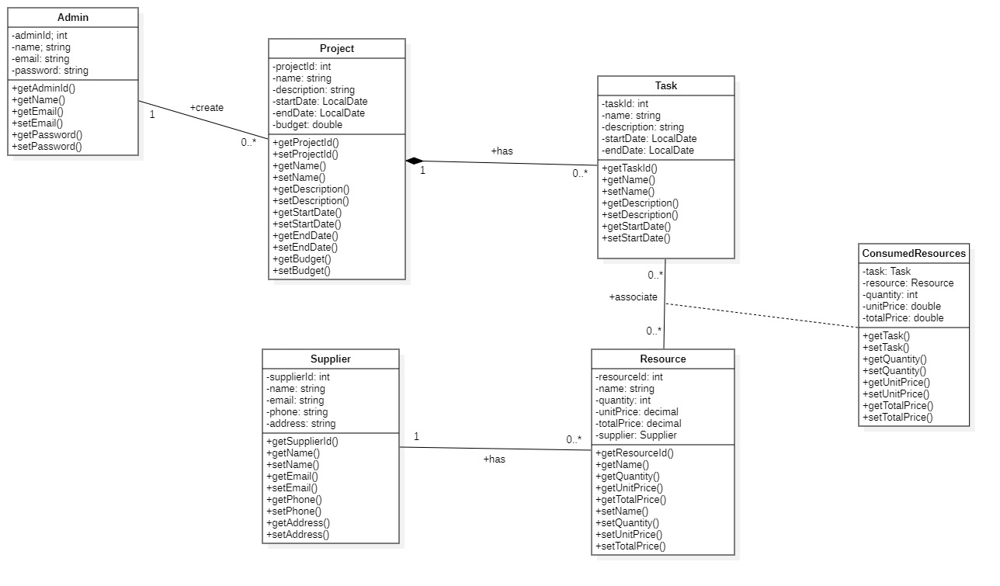

# ConstructionXpert Services

## Description

ConstructionXpert Services is a web application designed to help construction teams efficiently manage their projects. The application allows users to create and manage construction projects, assign tasks to team members, manage resources, and track project and task details. It provides a user-friendly interface for viewing, updating, and deleting projects. Each project can have multiple tasks, and each task requires specific resources.

## Features

### **Admin Functionalities**

#### **Project Management**

- Create a new project by specifying its name, description, start date, end date, and budget.
- View a list of existing projects with their details.
- Update details of an existing project.
- Delete an existing project.

#### **Task Management**

- Create a new task for a project by specifying its description, start date, end date, and required resources.
- View a list of tasks associated with a project along with their details.
- Update details of an existing task.
- Delete an existing task.

#### **Resource Management**

- Add new resources with details such as name, type, quantity, and supplier information.
- View a list of available resources with their details.
- Update details of an existing resource.
- Delete an existing resource.

## **Diagrams**
#### ***Use Case Diagram***

#### ***Entity Diagram***

#### ***Class Diagram***

#### ***Sequence Diagram***


## Installation and Setup

1. **Clone the Repository:**

   ```sh
   git clone https://github.com/your-repo/constructionxpert.git
   cd constructionxpert
   ```

2. **Install Dependencies:**
   - reload maven project

3. **Configure the Database:**

    - execute sql queries in files (tables.sql & triggers.sql)


## Technologies Used

- [Backend: Jakarta EE]
- [Frontend: Tailwind]
- [Database: SQL]
- [Font awsome for icons]

## Contact
For any inquiries, feel free to reach out at **[****[sineoussama@gmail.com](mailto\:sineoussama@gmail.com)****]**.

